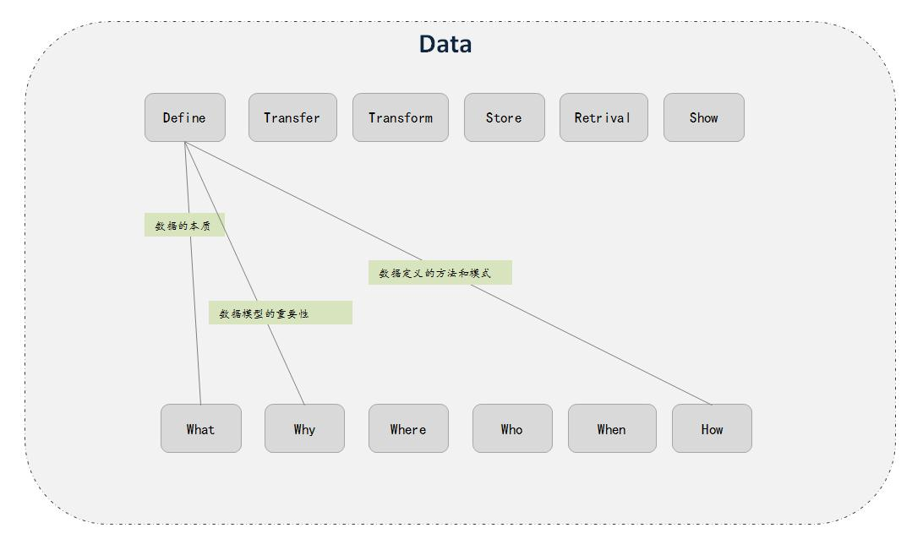

# 什么是 UML
UML : 统一建模语言， unified modeling language
是一种面向对象的建模语言，它是运用统一的，标准化的标记和定义实现对软件系统进行面相对象的描述和建模。

5类图：用例图，静态图，行为图，交互图，实现图

要辩证的去思考各种建模方法，它们更适应于哪些场景，知其然，更要知其所以然！

# UML 中的关系模型

关系也是数据，也需要有对应的模型，这样就更容易去思考和设计。

关系模型的结构:
1. 类型：依赖，聚合，关联，继承（实现）
2. 方向：
3. 程度：
4. 表示形式：
5. 生存期： immutable or mutable？

# 思考

UML 终究是用面向对象的思维去思考和设计软件系统，但软件系统的本质不一定非要是面向对象的。软件的本质是信息处理，有时候用“纯数据”的思维方式去思考和设计，比用 UML 更贴近实质，也更简单，更容易理解。

面向对象的核心思想之一：用对象来封装数据和行为。

当然，这有很多优点和好处，但同时也引入的新的概念，让设计和开发人员无法直面软件系统的本质，间接的增加了复杂度。

UML 中引入了很多概念，比如用例图，交互图，时序图，状态图，类图，对象图，.... 所有这些其实本质上都是对数据的处理，包括定义，传递，转换，存储，检索，展示。某种形式上，UML 让设计者离软件设计的真相更远了。当然，从技术的角度上，UML 技术在数据建模上，有很多值得学习的点，但尽信书不如无书。

	
